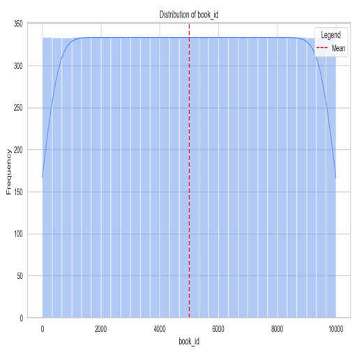
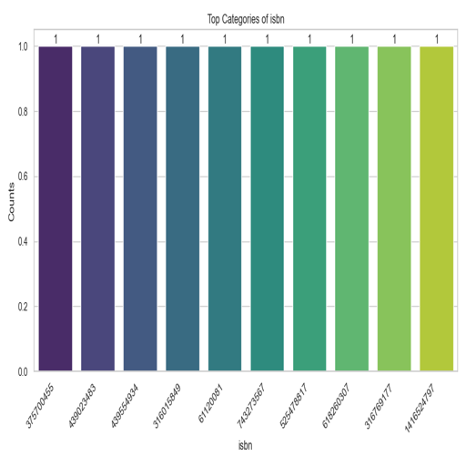
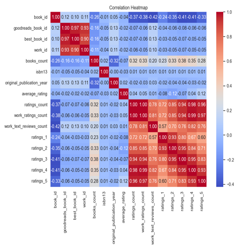

# Data Analysis and Visualizations

Welcome to the data analysis report! This document outlines key insights derived from the data and is supported by visualizations to provide an intuitive understanding of trends and patterns.

## Key Insights

### 1. Unveiling the Distribution of book_id

- **What we see**: The histogram showcases how values in book_id are distributed. A noticeable concentration can be observed, indicating common ranges.
- **Why it matters**: Understanding this distribution helps us identify typical values and spot any anomalies or outliers.
- **So what?**: This insight can guide decisions, such as focusing on optimizing for the most frequent ranges or investigating outliers further.

### 2. Exploring Top Categories of isbn

- **What we see**: The bar chart highlights the top 10 most frequent categories in isbn, revealing dominant trends or preferences.
- **Why it matters**: Recognizing dominant categories can guide priorities, such as addressing the needs of the majority.
- **So what?**: This enables targeted strategies that align with the most significant trends or patterns in the data.

### 3. Investigating Variable Relationships with a Heatmap

- **What we see**: The heatmap displays correlations between numeric columns. Strong positive or negative relationships are highlighted, providing quick insights.
- **Why it matters**: Identifying correlated variables helps in understanding underlying patterns and can guide feature selection for predictive models.
- **So what?**: Leveraging these correlations can improve model accuracy and reveal meaningful connections within the data.
